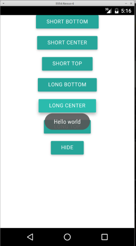
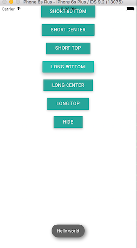

# ocaml-cordova-plugin-toast-example

This is an example of the binding to the *cordova-plugin-x-toast*. See the
binding [here](https://github.com/dannywillems/ocaml-cordova-plugin-toast).

 

## How to compile?

1. Add the plugin list repository as a remote opam package provider with
```Shell
opam repository add cordova https://github.com/dannywillems/ocaml-cordova-plugin-list.git
```

2. Initialize the project directory with
```
make init
```

3. Run (and build).
```
# Run on Android
make run_android
# Run on iOS
make run_ios
```
